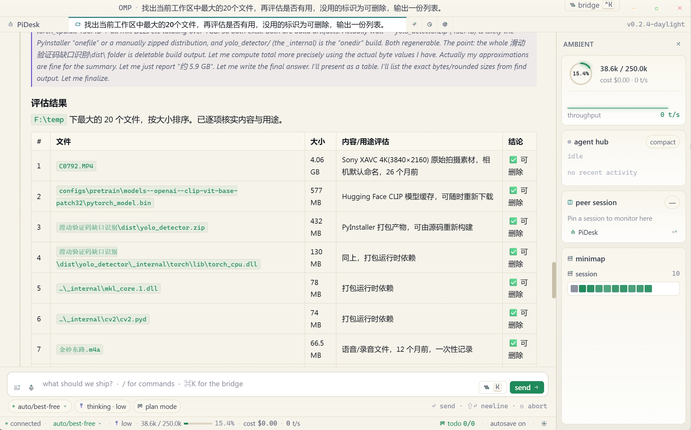

# PiDesk

**语言：** [English](README.md) · [简体中文](README.zh-CN.md)

面向 [oh-my-pi](https://github.com/can1357/oh-my-pi)（`omp`）的轻量、高性能 Tauri 2 桌面壳。
将 `omp --mode rpc` 编码代理作为受管子进程运行，并以 React 界面提供实时连接体验——无需浏览器、无需 Electron，二进制体积约 8 MB。

> **说明**：PiDesk 是从 [apoc/omp-desktop](https://github.com/apoc/omp-desktop) 演进而来的独立项目。

## 功能

**聊天与会话**
- 按标签页隔离会话——每个标签页拥有独立的 `omp --mode rpc` 进程
- 完整会话快照：切换标签页时保留状态，包括进行中的流式输出
- `/new` 命令开启新会话（历史仍保留在磁盘上）
- 对话历史面板（`Ctrl+H` / `⌘H` / `/history`）：浏览、搜索并在新标签页中恢复过往会话
- 模型选择器与双视图命令桥；可在状态栏循环切换或直接选择模型
- 自定义模型管理（`Ctrl+M` / `/models`）：在 `models.yml` 中通过可视化表单或原始 YAML 视图增删改配置，支持 API Key、OAuth 凭证复用及本地无密钥端点
- 思考级别控制：在 `off / minimal / low / medium / high / xhigh` 间循环（按模型——由 omp 决定支持的子集）
- 流式 token 展示，含 tokens/s 火花线与上下文窗口仪表

**计划模式**
- 在聊天窗口内启用「先起草再写入」工作流
- 首条消息会包在意图 framing 提示中；后续发送用于引导计划
- 行内计划批注：批准前可点击任意段落留言
- 批准按钮将所有批注合并为一条反馈提示并打开看板
- 看板面板根据代理的 `todo_write` 工具调用自动填充（进行中 / 已完成）

**工具卡片**
- `eval`（JS/Python 内核）与 `bash` 工具调用的实时流式输出
- 单元格完成后语法高亮代码块（highlight.js，atom-one-dark）
- `edit` 调用的可 scrub 统一 diff 查看器，带动画行揭示
- 对应工具的搜索预览、读取摘要、任务看板
- 每种工具类型独立图标与配色：read、search、edit、bash、eval、task、debug、ask

**小地图**
- 密集单元格网格（每条消息一格）替代旧条形堆叠——可容纳 200+ 条消息
- Token 热力图：助手单元格亮度按所用 token 对数缩放
- 悬停单元格 → 对应聊天气泡高亮并显示 accent 环
- 点击单元格 → 聊天区平滑滚动到该消息
- 工具提示显示角色、token 数（入/出）、工具名、耗时或消息预览

**Agent Hub** *（右侧环境导轨卡片）*
- 三种模式随实时会话状态自动切换
  - **Compact（紧凑，默认）**：心跳指示器、当前阶段标签、运行中工具计时器、最近 8 条完成动作的滚动追踪栏，以及按工具类型分色的迷你工具分布条——取代原来的 60 格雷达
  - **Tree（工作者树）**：`task`（子智能体扇出）工具启动时自动激活——展示每个 worker 节点的状态点、token 数、耗时、任务描述，以及可展开的实时日志流
  - **Summary（完成摘要）**：任务结束时显示每个 worker 的结果行与汇总数据；5 秒无交互后自动折叠回 Compact
- Hub 状态（`hubMode`、`hubAgents`、`hubHistory`）已完整集成进会话快照，切换标签页后视图状态保持不变

**原生壳**
- Tauri 2、Rust 后端，无 Electron、无 CDN 依赖
- 无边框窗口，Windows 与 macOS 上自定义交通灯 / 拖拽区域
- 原生文件夹选择器打开项目
- 严格 CSP；禁用 asset 协议；无 shell 插件暴露面




---

## 架构

```
┌─────────────────────────────────────────────────────┐
│  Tauri WebView  (src/)                              │
│                                                     │
│  app-live.jsx ──► OMP_BRIDGE ──► live.js            │
│       │                │                            │
│  React state    RPC event handlers                  │
│  (messages,     (turn, message, tool,               │
│   model, ctx,    extension_ui, sparkline)           │
│   kanban…)             │                            │
│                  adapter.js (pure transforms)       │
└────────────────────────┬────────────────────────────┘
                         │  Tauri IPC (invoke / events)
┌────────────────────────▼────────────────────────────┐
│  Rust  (src-tauri/src/)                             │
│                                                     │
│  AgentBridge                                        │
│    spawn  omp --mode rpc                            │
│    stdin  ◄── send_command (JSON lines)             │
│    stdout ──► agent://line events (JSON lines)      │
│    kill   on drop / stop_session / hot-reload         │
└────────────────────────┬────────────────────────────┘
                         │  stdin / stdout pipes
┌────────────────────────▼────────────────────────────┐
│  omp  (oh-my-pi coding agent)                       │
│    JSON-line RPC protocol                           │
│    streams AgentSessionEvents to stdout             │
└─────────────────────────────────────────────────────┘
```

---

## 环境要求

| 工具 | 版本 |
|------|------|
| [Rust](https://rustup.rs/) | stable（1.77+） |
| [Node.js](https://nodejs.org/) | 18+ |
| [Tauri CLI](https://tauri.app/start/prerequisites/) | 2.x（`npm install`） |
| [oh-my-pi](https://github.com/can1357/oh-my-pi) | 14.8+（`PATH` 中可用 `omp`） |

`omp` 必须在 `PATH` 中可用。Windows 上通常安装在 `%LOCALAPPDATA%\omp\omp.exe`，安装程序会将其加入 PATH。

---

## 快速开始

```bash
# 克隆
git clone https://github.com/RaiderWang/pidesk.git
cd pidesk

# 安装 Tauri CLI（仅开发依赖）
npm install

# 开发模式——前端热重载，后端变更时重建 Rust
npm run dev

# 生产构建
npm run build
```

调试构建下，开发模式会自动打开 WebView 开发者工具。

---

## 模型管理：OAuth 与自定义模型

PiDesk 提供统一的两层模型管理，整合**内置 / OAuth 登录提供商**与**用户自定义模型**。

### 1. 内置与 OAuth 登录模型（`omp login <provider>`）

在终端使用 `omp login <provider>` 登录 **Cursor**、**Anthropic**、**OpenAI Codex** 或 **GitHub Copilot** 等提供商时：
- **凭证存储**：会话凭证与刷新 token 安全保存在 `~/.omp/agent/agent.db` 的 SQLite 中。
- **模型目录**：代理通过 RPC 动态暴露完整模型目录（例如 100+ Cursor 模型、Claude 3.5/3.7 Sonnet、GPT-4o）。
- **访问位置**：所有已认证的 OAuth 模型直接出现在 PiDesk 的**切换模型**选择器中（点击底部状态栏模型名，或按 `Ctrl+K` / `⌘K` 选择 *switch model*）。
- **为何不在 `models.yml` 中**：OAuth 模型由 `omp` 内部 auth 存储管理，**不会**写入 `models.yml`，以保持自定义配置简洁并避免与上游版本漂移。

### 2. 自定义模型（`models.yml` / `Ctrl+M`）

PiDesk 可视化**模型管理器**（`Ctrl+M`、`/models`，或在模型选择器中点击 **manage**）完全通用，支持**任意第三方兼容模型**——包括商业 API（DeepSeek、OpenRouter、SiliconFlow、Groq、Together）、自托管运行时（Ollama、vLLM、LM Studio、LocalAI）或自定义反向代理：
- **配置路径**：读写 `~/.omp/agent/models.yml`（保存时自动备份为 `models.yml.bak`）。
- **双模式编辑**：结构化可视化表单与带语法校验的原始 YAML 编辑。
- **支持协议**：兼容 `openai-completions`（OpenAI 格式）、`anthropic-messages` 与 `gemini` 端点。
- **保留 schema**：保留 `compat`、`headers`、`modelOverrides` 等复杂嵌套结构。

### 3. 认证模式与凭证优先级

在模型管理器中配置提供商时，请选择适当的**认证模式**：

| 认证模式 | 适用场景 | 行为 |
|----------|----------|------|
| **`apiKey`（标准）** | 商业 API、网关与需认证的代理（如 DeepSeek、OpenRouter） | 发送 `Authorization: Bearer <key>`。标准 API Key 必填。 |
| **`oauth`（登录凭证）** | 扩展 OAuth 提供商 | 复用 `~/.omp/agent/agent.db` 中的 token。不发送 `apiKey`，以免覆盖登录 token。 |
| **`none`（无密钥）** | 本地无密钥运行时或开放端点（如本地 Ollama、vLLM、本地代理） | 不发送认证头。 |

> [!WARNING]
> **`omp` 中的凭证遮蔽优先级**：  
> 在 `omp` 中，`models.yml` 里显式的 `apiKey` 优先于 `agent.db` 中存储的 OAuth token。若你为 OAuth 提供商（如 `cursor` 或 `anthropic`）配置了 API Key，会遮蔽并覆盖 OAuth 登录会话。要使用登录凭证，请始终选择 **`OAuth`** 模式。

### 4. Base URL 配置

- **OAuth 提供商（如 `cursor`）**：**API Base URL 留空**以自动使用官方端点（Cursor 为 `https://api2.cursor.sh`）。仅当通过专用本地 HTTP/2 代理路由流量时才指定自定义 `baseUrl`。
- **第三方与兼容提供商**：为任意兼容提供商或反向代理指定端点 URL，例如：
  - 商业 / 聚合 API：`https://api.deepseek.com/v1`、`https://openrouter.ai/api/v1`
  - 自托管 / 本地运行时：`http://localhost:11434/v1`（Ollama）、`http://localhost:8000/v1`（vLLM）
  - 自定义反向代理 / 网关：`http://localhost:20128/v1`

### 5. 运行时模型重载

`omp` 代理会话在启动时加载并缓存模型配置：
- 在 `models.yml` 中新增或修改的模型在打开**新标签页**或重启会话后生效。
- 若当前会话无法切换到新添加的模型，PiDesk 会在聊天内提示打开新标签页。

---

## RPC 协议

前端仅通过 Tauri IPC 桥与 `omp` 通信。
`live.js` 通过 `invoke("send_command", { sessionId, json })` 发送 JSON 命令，Rust stdout 读取器发出 `agent://line` 事件。

### 发送的命令（stdin → omp）

| 命令 | 时机 |
|------|------|
| `get_state` | `ready` 时、每次 `turn_end` 后 |
| `get_messages` | `ready` 时 |
| `get_available_models` | `ready` 时 |
| `prompt` | 用户发送消息 |
| `abort` | 用户点击中止 |
| `set_model` | 用户在 ⌘K 桥中选择模型 |
| `cycle_model` | 用户点击 `/model` 命令 |
| `cycle_thinking_level` | 用户在输入区循环思考级别 / `/thinking` |
| `compact` | 用户运行 `/compact` |
| `export_html` | 用户运行 `/export` |
| `get_session_stats` | 每次 `turn_end` 后 |
| `extension_ui_response` | 交互式 UI 请求的自动取消 |

### 接收的事件（stdout → 前端）

| 事件 | 处理 |
|------|------|
| `ready` | 引导初始数据拉取 |
| `turn_start` / `turn_end` | 流式状态、TPS 计算、费用累计 |
| `message_start` | 创建用户/助手气泡；写入模型名 |
| `message_update` | 从累积内容更新流式气泡 |
| `message_end` | 定稿气泡（`streaming: false`） |
| `tool_execution_start` | 创建运行中的工具卡片 |
| `tool_execution_end` | 用结果/diff/输出定稿工具卡片 |
| `extension_ui_request` | 交互类型自动取消；其余忽略 |
| `agent_start` / `agent_end` | 重新拉取会话状态 |

---

## 关键设计决策

**`omp --mode rpc` 而非 `omp --rpc`** —— `--rpc` 不是有效参数；omp 会进入交互 TUI 并向 stdout 输出 ANSI 转义而非 JSON。已在源码中确认。

**空行 = 跳过，而非 EOF** —— Rust stdout 读取器曾对空行与 IO 错误都使用 `_ => break`；omp 输出一行空行就会静默终止读取线程。现为 `Ok("") => continue`，`Err(_) => break`。

**`AgentBridge` 在 drop 时 kill 子进程** —— 与 stdin 一并保存 `Child`。`drop`、`stop_inner` 以及 `start` 开头都会 `child.kill() + child.wait()`，热重载与关闭标签页不会留下孤儿 `omp` 进程。

**窗口控件使用事件委托** —— `WindowChrome` 在 `DOMContentLoaded` 之后由 React 渲染。此时 `querySelector` 找不到元素。所有窗口控件点击由 `document` 上的单一委托监听器处理。

**必须处理 `set_model` 响应** —— 否则 `state.model` 保持陈旧。下一次 `turn_start` 调用 `notify()` 会把旧模型推回 React，回合中途界面回退。现已处理响应并立即 `notify()`。

**⌘K 桥中模型列表在命令之上** —— 8 行命令时，模型区在 `max-height: 60vh` 之下，不滚动不可见。模型现渲染在最前。

---

## Tauri 命令

| 命令 | 签名 | 说明 |
|------|------|------|
| `start_session`   | `(sessionId: String, cwd: String) → Result<()>` | 为新标签页会话 spawn omp（`cwd: ""` = omp 默认） |
| `stop_session`    | `(sessionId: String) → ()`                       | 终止该标签页的 omp 进程并在后台 wait |
| `send_command`    | `(sessionId: String, json: String) → Result<()>`| 向该会话 omp stdin 写入一行 JSON |
| `session_status`  | `(sessionId: String) → Option<String>`           | 若上次 `start_session` 失败则返回缓存的启动错误 |
| `open_project`    | `() → Result<Option<String>>`                   | 原生文件夹选择对话框 |

---

## 前端状态流

```
omp stdout
  └─► agent://line Tauri event
        └─► handleLine(rawLine)
              ├─► _handleResponse(resp)   — RPC responses
              │     ├── get_state         → _applyRpcState() → notify()
              │     ├── get_available_models → state.models → notify()
              │     ├── set_model         → state.model + current flags → notify()
              │     └── cycle_model       → state.model + thinkingLevel → notify()
              └─► _handleEvent(ev)        — AgentSessionEvents
                    ├── turn_start/end    → isStreaming, TPS, cost
                    ├── message_*         → streamingBubble lifecycle
                    ├── tool_execution_*  → tool cards
                    └── extension_ui_request → auto-cancel interactive

notify()
  ├─► subscribers (OMP_BRIDGE.onUpdate callbacks)
  │     └─► React setState calls in app-live.jsx
  └─► window.OMP_DATA sync (for components reading globals directly)
```

---

## 微调（Tweaks）

打开微调面板（右下角状态栏齿轮图标）可调整：

| 设置 | 选项 |
|------|------|
| 语言 | English · 简体中文（即时切换，本地持久化） |
| 主题 | aurora · phosphor · daylight |
| 密度 | cozy · compact · dense |
| 强调色 | 7 种预设 + 自定义 |
| 等宽聊天字体 | 开关 |
| 字号 | 75% – 150% 滑块 |
| 布局 | rail · split · focus |

---

## 开发说明

**`test-rpc.mjs`** —— 独立 Bun/Node 脚本，直接 spawn `omp --mode rpc` 并演练协议。无需完整 UI 即可验证 RPC 行为。

**无 CDN 依赖** —— React 18、ReactDOM 与 Babel standalone 本地打包在 `src/` 下。应用可完全离线运行。

**`src/design/`** —— 原始 `design/` 原型的修改副本。原始 `design/` 目录不在仓库中（`.gitignore`）；`src/design/` 已提交且为权威来源。不要从 `design/` 重新生成——会覆盖实时桥接改动。

**Windows 11 目标** —— 使用 `color-mix(in oklab, …)`，需要 WebView2 ≥ 101（Windows 11 默认）。无边框窗口（`decorations: false`）依赖 DWM 圆角。

---

## 许可与致谢

PiDesk 在 [MIT License](LICENSE) 下开源。  
原始作品 Copyright (c) 2026 Miroslav Drbal（[apoc/omp-desktop](https://github.com/apoc/omp-desktop)）。  
修改与增强 Copyright (c) 2026 Rick Wang。
